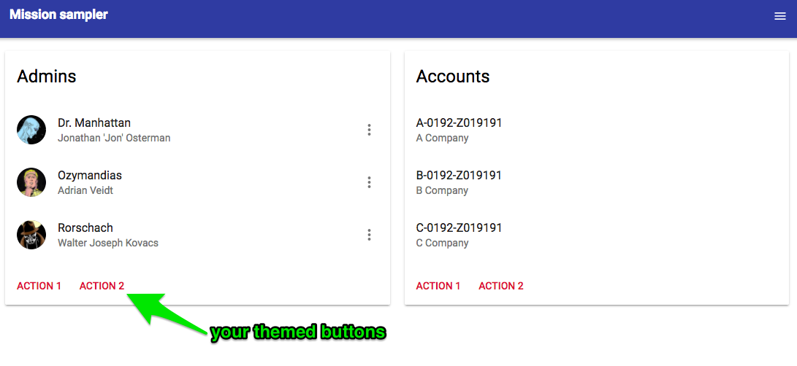

# missionsampler
Sample Project

See the [demo at https://webcamp-ua.github.io/missionsampler/](https://webcamp-ua.github.io/missionsampler/)

This project is a sample for demonstration of [react](https://facebook.github.io/react/) + [reeact-toolbox](http://react-toolbox.com/#/) + [webpack v1](https://webpack.github.io/) UI theming as described in the article.

In this branch I've tried the option to add theme [using SASS imports and context](https://github.com/react-toolbox/react-toolbox/tree/master#using-sass-imports-and-context).

---
JavaScript

Create new file `theme.js` and define an object with component keys and style file paths.
```
//src/theme.js

export default {
    RTButton: require('./scss/button.scss')
};
```
Provide the `theme.js` as the `theme` property of the `ThemeProvider` component, that wraps your root component.
```
//src/index.js

import React from 'react';
import ReactDOM from 'react-dom';
import AppLayout from './AppLayout';
import {ThemeProvider} from 'react-css-themr';
import theme from './theme.js';
import style from './style';

ReactDOM.render(
    <ThemeProvider theme={theme}>
        <AppLayout />
    </ThemeProvider>, document.getElementById('mission-sampler'));
```

---
SCSS

Define styles in the respective `scss` file.

```
//src/scss/button.scss

@import "~react-toolbox/lib/button/theme";
.button{
  color: #dd1842 !important;
}
```



---
### To run in dev mode:
 
``` 
npm install
npm run dev 
 
```
 
### To run in production mode:
 
``` 
npm install
npm run build
npm start

```

