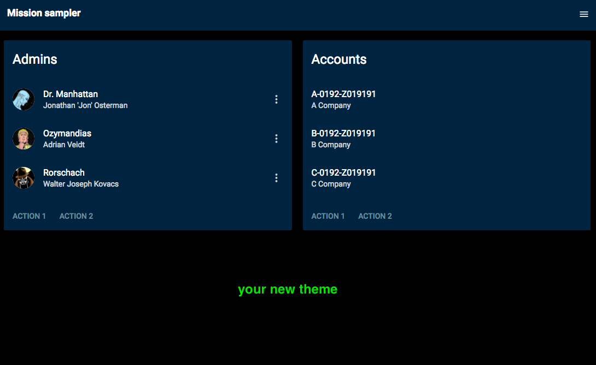

# missionsampler
Sample Project

See the [demo at https://webcamp-ua.github.io/missionsampler/](https://webcamp-ua.github.io/missionsampler/)

This project is a sample for demonstration of [react](https://facebook.github.io/react/) + [reeact-toolbox](http://react-toolbox.com/#/) + [webpack v1](https://webpack.github.io/) UI theming as described in the article.

In this branch I've tried the option to add theme [using SASS Loader](https://github.com/react-toolbox/react-toolbox/tree/master#using-sass-loader).

---
SCSS

- create file `theme.scss`
- `@import` react-toolbox variables
- define your variables
- redefine react-toolbox variables with your ones

```
@import "~react-toolbox/lib/colors";
@import "~react-toolbox/lib/globals";

$black-two: #191917;
$black: #2a2925;
$bluegrey: #6c8b9b;
$charcoal-grey: #334147;
$cool-grey: #929ca1;
$navy: #00253e;

//Basic palette
$color-accent: #FB4554;
$color-primary: $black-two;
$color-primary-dark: darken($color-primary, 10%);
$color-primary-contrast: $cool-grey;
$body-bg: $color-black;
$body-text-color: $color-white;
```

---
Webpack(v1)

Add `sassLoader` field to your `webpack.config.js`

```
//... 
sassLoader: {
    data: '@import "' + path.resolve(__dirname, 'theme/_theme.scss') + '";'
}
```

---


---

### To run in dev mode:
 
``` 
npm install
npm run dev 
 
```
 
### To run in production mode:
 
``` 
npm install
npm run build
npm start

```

